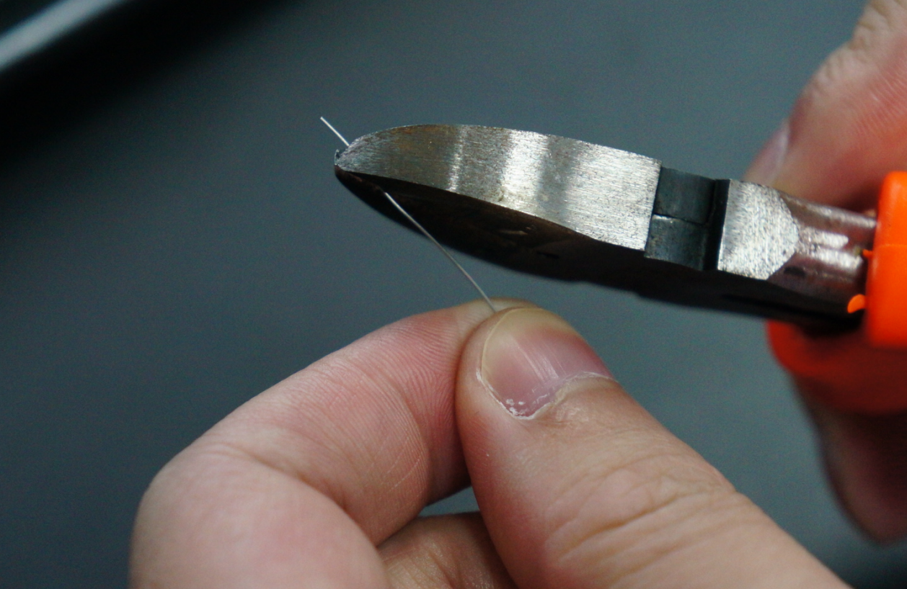
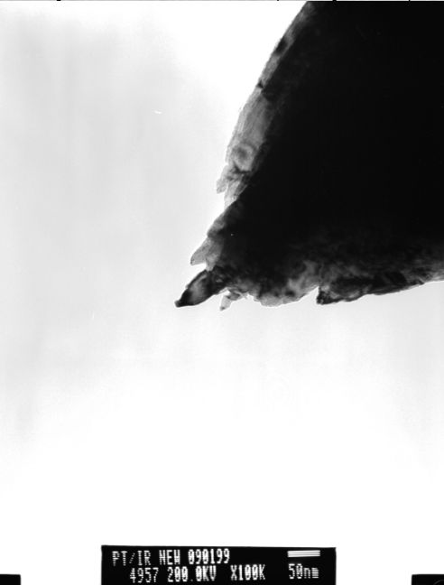

# 扫描探针制备

        对于扫描隧道显微镜的扫描探针，最理想的情况是扫描探针的针尖仅有一个原子用于传输隧穿电流[1]。但需要制备这种探针的条件过于苛刻，且对于本项目而言难度过大。

        在参考了瑞士Nano Surf公司生产的桌面扫描隧道显微镜的操作过程以及部分爱好者在网络上公开对于扫描探针的制备方法后，采用以下方法对探针进行制备：

（1）选择导电惰性金属材料（如铂铱合金）作为探针材料，以避免制备后的针尖氧化。此处选择直径为0.3mm~0.4mm的铂金丝或钨丝作为探针材料。

（2）使用剪线钳以45°对探针丝进行剪切的同时向前拉“扯探”针丝，制备形成探针尖端。

在上述针尖制备方法的过程中，探针丝的尖端由于“拉扯”而断裂形成，断裂截面的原子分布并非绝对平整。在显微镜的实际扫描的过程中，推测隧穿电流可能由某个最为突出的原子“主导”，从而也能实现较高的分辨率。

根据普渡大学对直径为0.008"的Pt/Ir金属丝进行机械拉伸剪裁后，对针尖的SEM图像显示[2]，通过此方法制备的扫描针尖能够达到可观的尖锐程度。

# 参考资料

[1].    Lounis S. Theory of scanning tunneling microscopy[J]. arXiv preprint arXiv:1404.0961, 2014.

[2].    Purdue University. TEM Pictures of STM Tips[EB/OL]. 2002[2022-9-20]. https://www.physics.purdue.edu/nanophys/uhvstm/tip.html.
