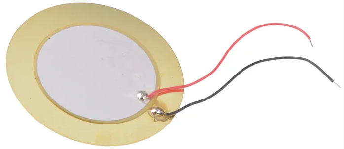
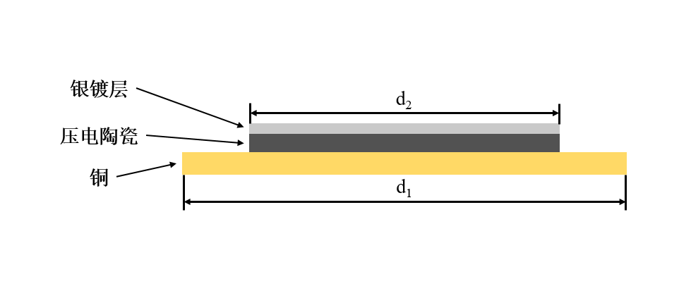
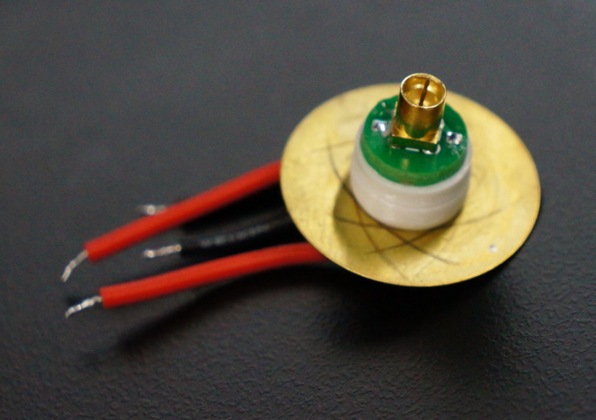
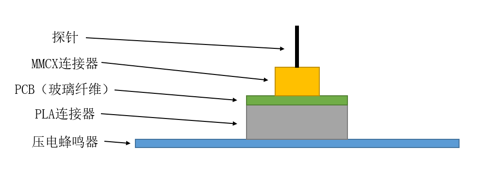
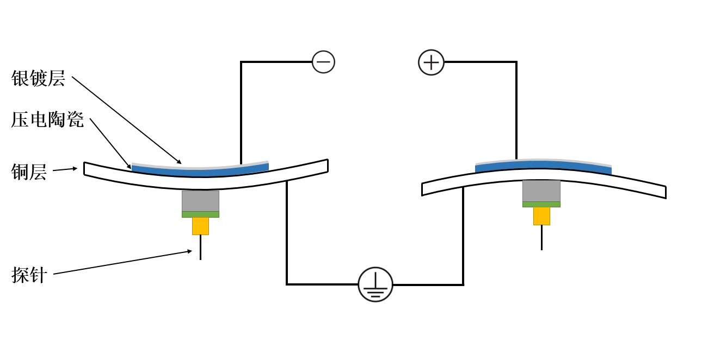
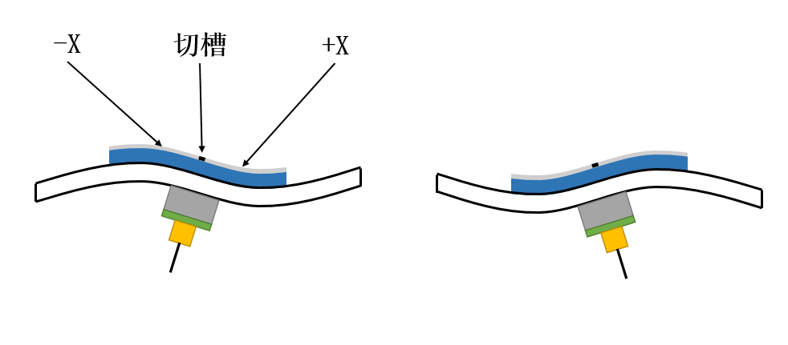
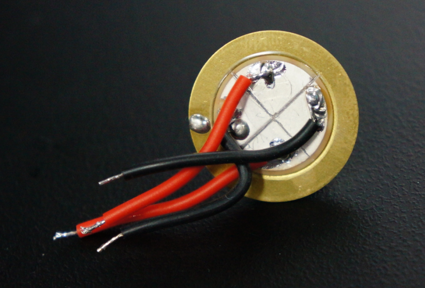

# 压电扫描头设计

## 压电扫描头器件选择

        对于扫描隧道显微镜而言，扫描头的分辨率决定了图像的分辨率。除此之外，对于隧道电流的建立也主要由扫描头来完成。考虑到空气中隧穿距离的普遍距离在10Å以内[1][2]，故需要扫描头的形变需要控制在纳米级别。

        在商业扫描隧道显微镜中，普遍采用压电晶体作为压电扫描头的执行器，但直接购买商用压电晶体管成本较高且驱动难度较大。在经过调研后发现，由John D. Alexander提出的结构[3]可以利用内置了压电晶体的压电蜂鸣器（如图）进行改造，制成能够用于扫描隧道显微镜的压电扫描头。

## 压电蜂鸣器工作原理

常见的盘状压电蜂鸣器的侧视结构如下图所示：

        压电蜂鸣器主要由三个圆盘层构成：铜层、压电陶瓷层和镀银层。铜层半径为d1，压电陶瓷层及镀银层半径为d2。本项目使用的木村(muRata)7BB-20-6L0型压电蜂鸣器直径d1=20mm，d2=14mm。

        铜层与镀银层与压电陶瓷存在直接的导电接触，并且导线被分别焊接在铜层和镀银层上用于给压电陶瓷施加电场。此外，铜层除了提供导电接触外，还能够为压电蜂鸣器提供一定的机械强度以及作为蜂鸣器的振膜。

        利用逆压电效应，通过在压电陶瓷两侧施加电压，可以让压电陶瓷发生形变。对压电蜂鸣器施加不同频率的交变电压，压电蜂鸣器便会发出不同频率的声音，这即是压电蜂鸣器的工作原理。

        以7BB-20-6L0型压电蜂鸣器为例，如下图所示：当通过引线对镀银层施加正向电压时，蜂鸣器整体向镀银层方向弯曲，当对铜层施加正向电压时，蜂鸣器整体向铜层方向弯曲。

        对于压电陶瓷而言，存在两个需要关注的参数：即纵向压电应变常数和横向压电应变常数。纵向压电应变常数(d33)描述了电场和形变方向一致时的电场、电压对应变的转换关系，而横向压电应变常数(d31)则是描述了电场和形变方向垂直时的转换关系[4]。用公式可表达为（其中S为材料应变，d为压电常数，E为电场强度）：S=dE

        当考虑对压电陶瓷施加电压时，压电陶瓷产生的形变量可以使用以下公式表示（其中ΔL为形变量，d为压电常数，V为施加电压）：ΔL=dV

        下表列出了常用于压电蜂鸣器的压电陶瓷的横向压电应变常数：

| 压电陶瓷类型 | d31(nm/V) |
|:------:|:---------:|
| PZT-5A | -0.18     |
| BM500  | -0.16     |
| PZT-5H | -0.27     |
| BM527  | -0.25     |
| PZT-4  | -0.12     |

        对于压电蜂鸣器而言，其所能够产生的弯曲形变是利用了压电陶瓷的横向应变的特性。在图3.9中，压电蜂鸣器的圆盘形压电陶瓷在受到电场作用下沿水平方向“舒张”或“收缩”，从而产生弯曲。在应力一定的情况下，压电蜂鸣器的弯曲程度由横向应变常数和电压决定，从表3.1的参数中可以看到，常用的压电陶瓷d31在-0.12nm/V~-0.25nm/V，由此可判断将压电蜂鸣器用于扫描隧道显微镜的扫描头是可行的。

## 压电扫描头结构

        本项目的压电扫描头的实物图及结构图如图所示：

        压电扫描头的部件由图3.11所示的五个部分组成。PLA连接器为聚乳酸的3D打印结构，用于连接压电蜂鸣器与PCB。PCB为玻璃纤维材料，为MMCX连接器提供焊盘。MMCX连接器为通讯用信号连接器，其内部具有直径为0.3~0.4mm的针座，可用于安装探针。压电蜂鸣器、PLA连接器、PCB之间使用502胶水进行粘接，PCB与MMCX连接器之间使用焊锡进行焊接固定。压电蜂鸣器的弯曲动作将通过中间的连接组件（PLA连接器、PCB、MMCX连接器）传递至探针，从而带动探针的移动。

        压电蜂鸣器的镀银层被均匀地覆盖在压电陶瓷的表面，此时的压电蜂鸣器只能实现一维弯曲。若使用切割工具将镀银层进行切割，并切割成如图所示的结构，压电蜂鸣器将能够实现三维的移动。

        所示的镀银层分割为+X、-X、+Y、-Y四个区域，四个区域的镀银层互不导通。此时若让蜂鸣器的铜层接地，即电压为0，当对四个区域施加相同的正电压或负电压时，探针将被带动向上移动或向下移动。

        对切割图的红色线条方向进行剖视，剖视的示意图如图3.14所示。当对-X区域的镀银层施加正向电压，对+X区域的镀银层施加大小相同的反向电压时，压电陶瓷将发生“S形”弯曲，探针将被带向-X方向。反之，若对-X区域施加反向电压，对+X区域施加正向电压，探针将被带向+X方向。对于-Y、+Y区域的情况和-X、+X原理相同。

        通过控制+X、-X和+Y、-Y间的相对电压差，可以实现探针的X、Y（前后左右）轴移动，通过控制四个区域整体对地（铜层）的电压差，可以实现探针的Z轴（上下）移动。

## 压电陶瓷的去极化

        目前广泛使用的压电陶瓷主要成分为锆钛酸铅Pb[Zr_x Ti_(1-x)]O_3 (0≤x≤1)，在制作过程中会将烧结好的压电陶瓷加以强场进行极化，但如果对已经极化完成的压电陶瓷施加过高的温度，压电陶瓷将去极化从而失效。

        主要成分同样为锆钛酸铅的NCE51型压电陶瓷在350~370℃将发生去极化[5]，由于muRata公司未提供7BB-20-6L0型压电蜂鸣器所用压电陶瓷的具体型号，为保险起见，在对压电蜂鸣器进行导线焊接时需要使用熔点为170℃左右的低温焊锡进行焊接，并将烙铁头温度控制在200℃左右以避免压电陶瓷发生去极化，从而影响压电扫描头的整体性能。

# 参考文献

[1].    Hahn J R, Hong Y A, Kang H. Electron tunneling across an interfacial water layer inside an STM junction: tunneling distance, barrier height and water polarization effect[J]. Applied Physics A, 1998, 66(1): S467-S472.

[2].    Woo D H, Choi E M, Yoon Y H, et al. Current–distance–voltage characteristics of electron tunneling through an electrochemical STM junction[J]. Surface science, 2007, 601(6): 1554-1559.

[3].    Alexander J D, Tortonese M, Nguyen T. Atomic force microscope with integrated optics for attachment to optical microscope: U.S. Patent 5,952,657[P]. 1999-9-14.

[4].    陈大任,李国荣,殷庆瑞.逆压电效应的压电常数和压电陶瓷微位移驱动器[J].无机材料学报,1997(06):861-866.

[5].    Fialka J, Benes P, Michlovska L, et al. Measurement of thermal depolarization effects in piezoelectric coefficients of soft PZT ceramics via the frequency and direct methods[J]. Journal of the European Ceramic Society, 2016, 36(11): 2727-2738.
