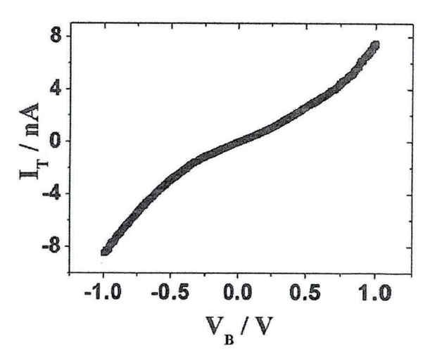
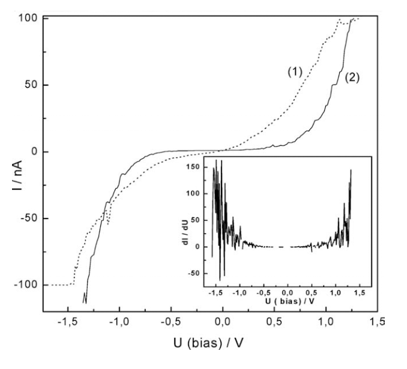

# 偏压测试

​        当探针与样品间距恒定时，通过改变偏置电压所测得的偏置电压-隧穿电流曲线测试得到的曲线与样品的表面电子态有一定的关系[27]，偏压-隧穿电流曲线取一阶微分将能够得到扫描隧道谱曲线[1]。

​        图4.9为扫描头恒定高度时，HOPG（高定向热解石墨）样品的偏压曲线，偏置电压间隔为3.1mV，其中黑色曲线为原始数据，红色曲线为平滑曲线。从曲线特征中可以看出，通过与其他研究人员的偏压曲线进行对比[2][3]，可初步认为本项目所测曲线满足一定的HOPG样品特征。

# 参考文献

[1].    Chen C J. Theory of scanning tunneling spectroscopy[J]. Journal of Vacuum Science & Technology A: Vacuum, Surfaces, and Films, 1988, 6(2): 319-322.

[2].    王琦. 高稳定扫描隧道显微镜的研制与应用[D].  中国科学技术大学,2014.

[3].    El Abedin S Z, Borissenko N, Endres F. Electrodeposition of nanoscale silicon in a room temperature ionic liquid[J]. Electrochemistry communications, 2004, 6(5): 510-514.