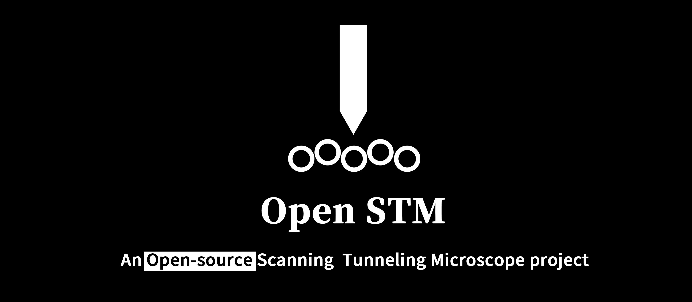

# 简介

你好，本项目是一个旨在通过DIY来搭建一个原子级扫描隧道显微镜。

截止至2021年11月，本项目已经搭建起了不稳定的隧穿电流。

# 开源文件结构介绍

由于本项目尚未完成，故在此仅对已开源的文件进行简单介绍，暂不详细介绍使用方法。

- 3DModels

  该目录包括了使用SolidWorks绘制的扫描隧道显微镜模型。

- ArduinoProject

  该目录包括了使用[Arduino](https://www.arduino.cc/)（[PlatformIO](https://platformio.org/)）完成的工程。

  - DAC_CONTROLLER

    该目录包括了以ESP32主控制器，用于控制DAC的工程（使用了LVGL图形库）。

  - ViberationDetector

    该目录包括了用于机械振动频率分析的小工具。（使用了MPU6050及FFT库）。

- Documents

  该目录下包括了在开发过程中参考的论文、数据手册。（如涉及版权问题，请提交Issue删除）

- PCBs

  该目录下包括了DAC控制板、前级放大器、DAC板的立创EDA工程。

- PythonScripts

  该目录下包括了Python脚本工具，目前仅有用于数干涉条纹的工具。

- Simulation

  该目录放置仿真文件，目前仅有ADP5070基于SpiceSimulation的仿真。

# 联系我

如果你也想制作一个STM显微镜，或者对我有什么建议的话，可以在此页面提交Issue。

# 开发记录

- 2021/11

  不稳定隧穿

- 2022/1/11

  开源页面提交

- 2022/1/18

  减震台下加装了<网球>，减震效果拔群

- 2022/2/05

  1）系统模拟部分供电改为9V电池供电，数字部分继续使用开关电源。  
  2）ADP5070不工作了，奶奶的！为什么。  
  3）在《 Construction of a scanning tunneling microscope for imaging of carbon nanotubes》P35中发现隧穿电流应在100pA - 10nA，按照现有运放的倍数应该关注1V以内的信号，之前看样子搞错了。  
  4）OPA627的 ~~开环电压增益有120dB，~~ 输入偏置电流1pA，讲道理用100MΩ的反馈电阻应该是可行的？  

- 2022/2/16  

  对运放的输入输出特性进行了测试，证明前级隧道电流放大电路是可行的。
    
- 2022/3/14  

  1）CNC加工的新结构加工完成  
  2）摒弃LVGL与显示屏作为控制系统  

- 2022/3/21  
  
  使用了新的结构系统、电路、控制系统进行了隧穿电流进近测试：  
  1）隧穿电流初步稳定，能够维持十几秒。  
  2）通过八个点的采样测试隧穿电流-压电陶瓷形变曲线发现基本符合指数特征。  
  3）确认并不需要非常复杂的减震系统。  
  4）基本确认之前出现的输出跳动现象为热膨胀的失配。

- 2022/4/12  

  1）在对进近机械结构中的步进电机进行热隔离调整后，隧穿电流已非常稳定，能够维持至少30分钟。  
  2）对新的隧穿曲线进行分析，发现电流-压电陶瓷形变关系并不只是单纯的指数关系，结合老师给出的意见，怀疑有其他函数复合。初步怀疑为针尖与样品间形成的电容器导致的。  
  3）完善了细进近控制算法，现在可以点击开始进近之后去打几把极地大乱斗。  
  4）模拟部分供电由9V电池供电更换为3S锂聚合物电池供电。
  
- 2022/4/20  
  完成恒高模式下的STM图像扫描，并经过重复性实验验证，但无法确定图像尺度以及成像内容的完全可靠。

- 2022/5/01  
  攥写毕业设计论文。

- 2022/5/04  
  毕业设计论文攥写完成70%，开始编写恒流扫描算法。  
  
  